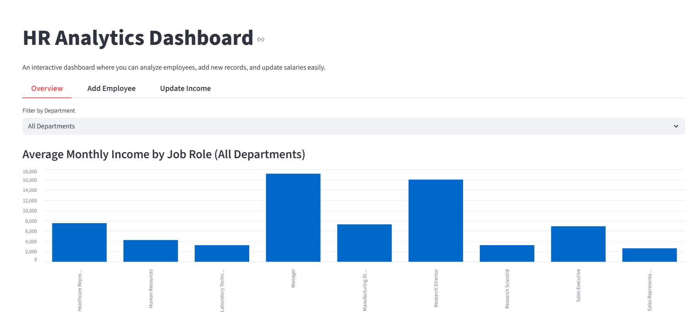
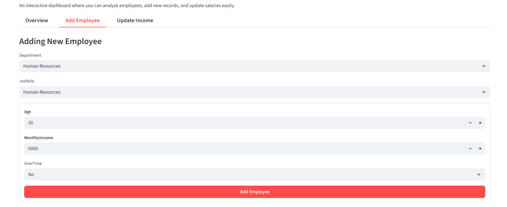
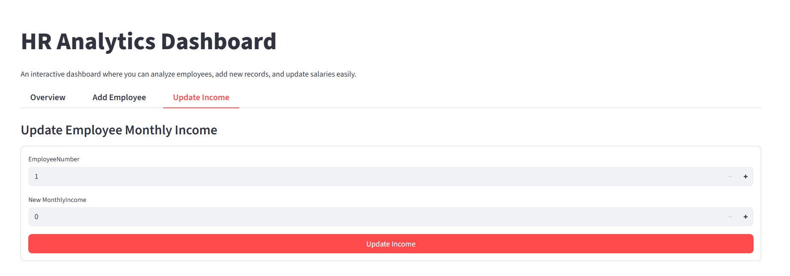
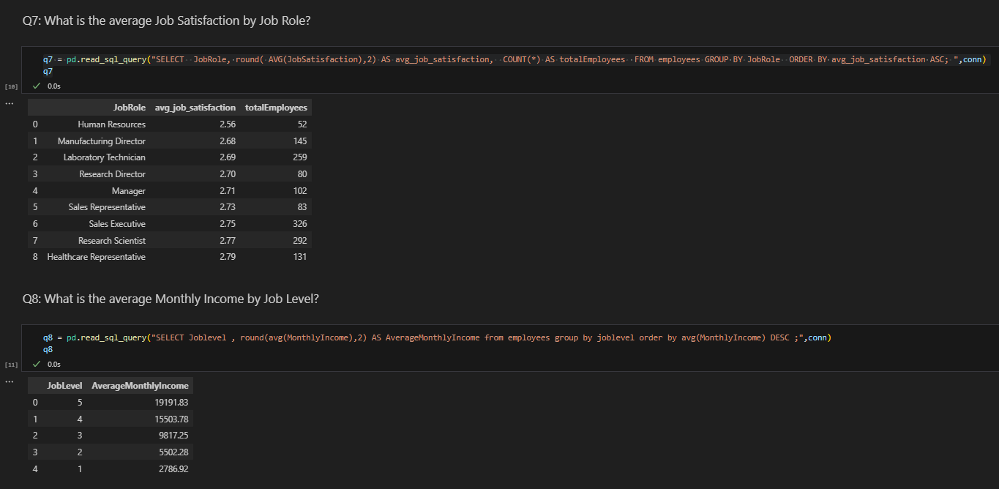

# 📊 HR Analytics Dashboard  

  
  
  
  

---

## ✨ Pitch  
An interactive dashboard that helps HR teams **analyze employee data**,  
**track attrition and performance**, and **manage records easily**.  

---

## 📑 Table of Contents  
- [Project Overview](#-project-overview)  
- [Project Structure](#-project-structure)  
- [Features](#-features)  
- [Dataset](#-dataset)  
- [Technologies](#-technologies)  
- [How to Run](#-how-to-run)  
- [Data Dictionary](#-data-dictionary)  
- [Author & Acknowledgments](#-author--acknowledgments)  
- [License](#-license)  

---

## 📘 Project Overview  
This project focuses on analyzing **employee attrition, performance, and satisfaction**  
using the IBM HR dataset.  
It demonstrates how **SQL** and **Python (Pandas)** can be combined with  
**Streamlit** to deliver an **interactive HR analytics dashboard**.  

The dashboard makes it easy to:  
- Explore HR data interactively  
- Generate key insights through visualizations  
- Add new employee records  
- Update existing employee salaries  

---

## 📂 Project Structure  
    data/   
    ├─ employees.db        # SQLite database (generated from CSV)     
    └─ WA_Fn-UseC_-HR-Employee-Attrition.csv # Original dataset

    notebooks/   
    └─ dbDemo.ipynb     # Jupyter Notebook with SQL + Python queries

    src/   
    └─ app.py          # Streamlit web app (Dashboard + Add/Update employees)

    .gitignore
    LICENSE
    README.md                                 # Project documentation
    requirements.txt                          # Python dependencies
---

## 🚀 Features  
✔️ **Dashboard (Overview):** Filter employees by department, visualize average monthly income, and view employee details  
✔️ **Add Employee:** Insert new employee records into the database  
✔️ **Update Income:** Update employee salaries directly from the dashboard  
✔️ **Queries:** SQL + Python queries for HR insights  

---

## 📑 Dataset  
We use the **IBM HR Analytics Employee Attrition & Performance** dataset from Kaggle.  
👉 [Dataset Link](https://www.kaggle.com/datasets/pavansubhasht/ibm-hr-analytics-attrition-dataset)  

It contains **1,470 employee records** with details such as:  
- Department  
- Job Role  
- Age  
- Gender  
- Monthly Income  
- Performance Rating  
- Job Satisfaction  
- Attrition (whether an employee left or not)  

---

## 📊 Data Dictionary  
Some key columns in the dataset:  

- **Age** → Age of the employee  
- **Attrition** → Whether the employee left the company (Yes/No)  
- **Department** → HR, Sales, or R&D  
- **JobRole** → Specific role of the employee  
- **MonthlyIncome** → Employee’s monthly salary  
- **PerformanceRating** → Performance rating (1–4 scale)  
- **JobSatisfaction** → Satisfaction score (1–4 scale)  

---

## 🛠️ Technologies  
- Python  
- Pandas  
- SQLite  
- Streamlit  
- Plotly  

---

## ▶️ How to Run  

### Setup and Local Installation  
Clone the repo and install dependencies:  

    git clone https://github.com/AhmadAlali229/HR-Analytics-v2
    cd HR-Analytics-v2
    pip install -r requirements.txt
    Usage
    Run the Streamlit app:
    streamlit run app.py

## Author & Acknowledgments
Author: Ahmad Alali

Dataset Provider: IBM via Kaggle

### License   
This project is licensed under the MIT License.